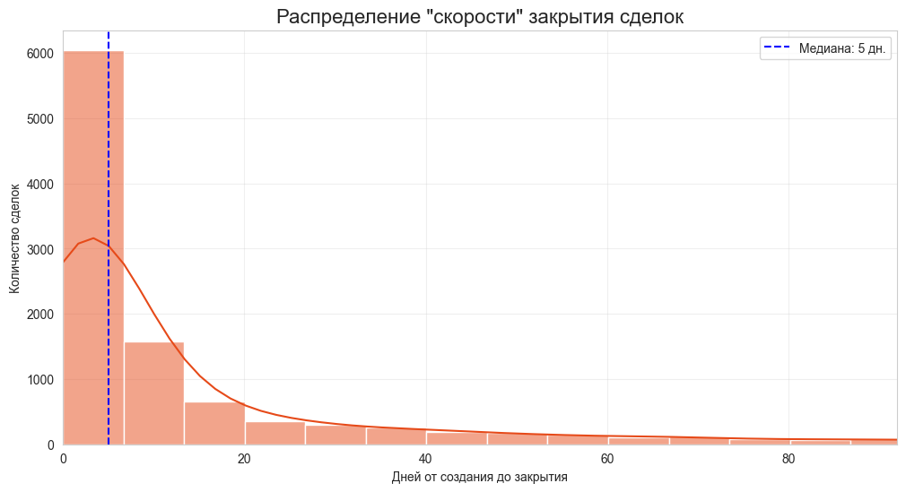
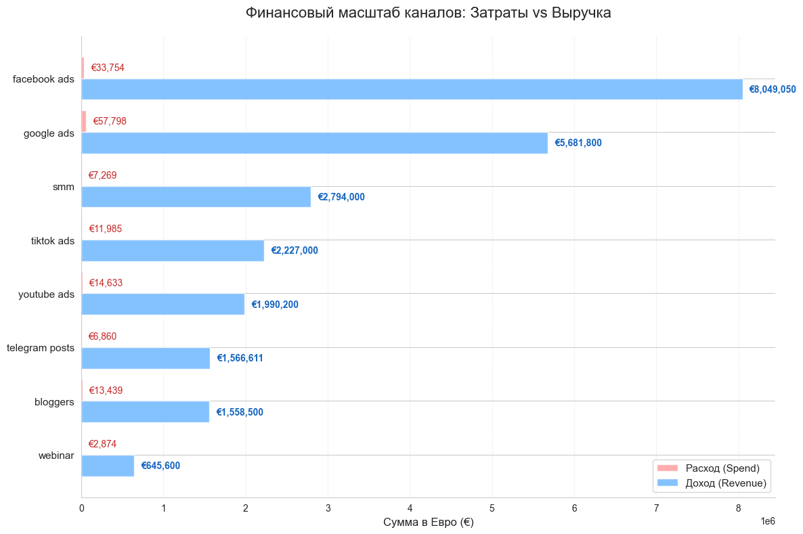
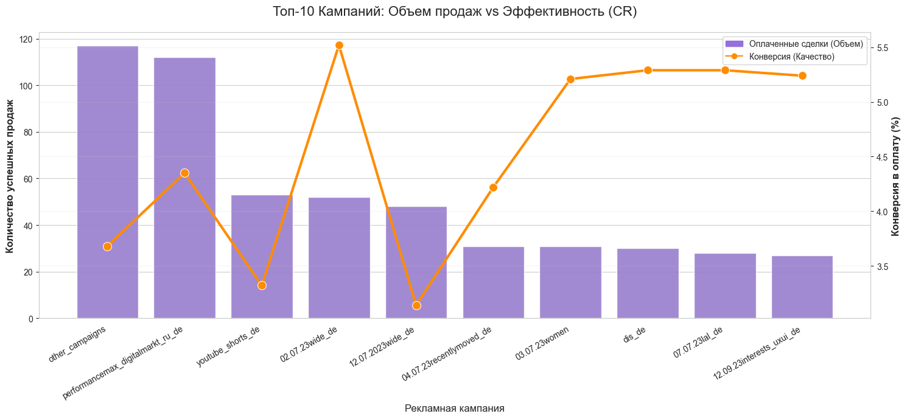
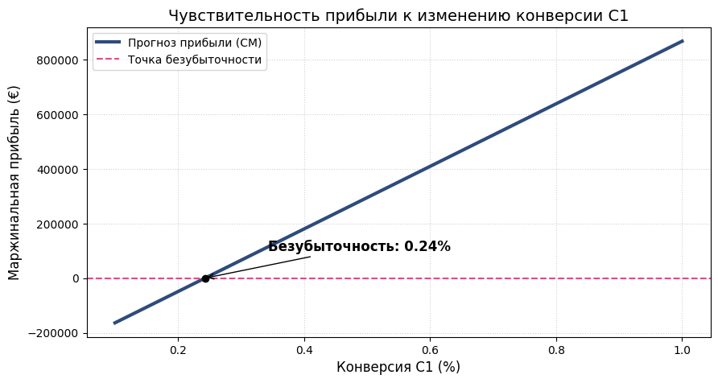

# CRM Analytics & Unit Economics — Online Programming School

End-to-end analysis of **18,548 CRM leads** for an online programming school: from raw multi-source data to a quantified growth strategy and a data-backed A/B-test hypothesis.

**Capstone project** of a 10-month full-time Data Analyst training (IT Career Hub, Berlin). Built and presented in German.

---

## Business Questions

1. Where does the sales funnel actually leak — in marketing, in sales operations, or in product mix?
2. Which marketing channels deserve more budget, and which burn it?
3. How much does reaction speed (SLA) cost the business?
4. Where is the single biggest growth lever, expressed in euros?

## Data

Four raw datasets exported from the CRM and ad platforms:

| Dataset | Content |
|---|---|
| `deals` | CRM pipeline: stages, amounts, products, owners, timestamps |
| `calls` | Sales-call logs per lead |
| `contacts` | Lead records with acquisition source |
| `spend` | Marketing spend per channel/campaign |

> **Note:** the underlying data belongs to the training provider and is not published in this repository. All notebooks are kept with executed outputs, so every chart, table and conclusion is visible without re-running the code.

## Key Findings

**1. Speed is the cheapest growth lever.**
Calling a lead within the first **15 minutes** yields a **6.41%** conversion rate. After **24 hours** of waiting, conversion drops to **0.00%** — yet **44.2%** of all paid traffic was processed with a 4–24 hour delay. The ad budget spent on slowly-processed leads is effectively written off.

**2. "Silent sales" are the most profitable segment.**
**37.1%** of won deals were paid without a single productive sales call. **42.5%** of all wins close within the first three days ("sprint sales") — after 14 days in the pipeline, win probability drops threefold.

**3. The qualification stage silently loses six figures.**
Over **16,000 leads** stuck in `not_assigned` status convert at **0.09%** and generate an estimated operating loss of **>€278K**. Fixing first-touch qualification (C1) beats buying more traffic — confirmed by a metric-tree diagnosis (Theory of Constraints) and a what-if simulation of growth levers.

**4. Channels are not equal — and campaign-level ROI is partly unknowable.**
SMM and webinar traffic deliver the best payback (CPL €4.20 on SMM); Google Ads delivers the cheapest click (€0.23) but a 1.7% click-to-lead rate and the highest CAC. A data-quality audit also showed that ad-platform campaign names don't match CRM UTM tags — making campaign-level ROI mathematically unverifiable until tracking is fixed. Documenting this limitation honestly is part of the analysis.

**Resulting A/B-test hypothesis:** prioritised call-back queue with a 15-minute SLA for new leads, with the expected conversion uplift quantified before the test.

| | |
|---|---|
|  |  |
|  |  |

## Methods & Stack

- **Python**: pandas, NumPy, seaborn, matplotlib, Plotly
- **ETL & data quality**: deduplication, payment-amount reconciliation, source-name unification across CRM and ad platforms
- **Analytics**: funnel analysis, cohort-style deal-cycle timing, SLA impact analysis, sales-rep productivity, CPL / CAC / ROMI per channel
- **Unit economics**: UA, C1, AOV, LTV/LTC per product; hierarchical metric tree; what-if simulation of growth levers
- **Interactive dashboard**: Dash + Plotly — reactive KPI monitoring (revenue, CR, AOV, leads) with course/city filters

## Repository Structure

```
├── notebooks/
│   ├── 01_data_prepare_deals.ipynb      # ETL & EDA per dataset
│   ├── 01_data_prepare_calls.ipynb
│   ├── 01_data_prepare_contacts.ipynb
│   ├── 01_data_prepare_spend.ipynb
│   ├── 02_crm_data_analytics.ipynb      # funnel, channels, SLA, sales team
│   ├── 03_crm_product_analytics.ipynb   # unit economics, metric tree, what-if
│   └── utils.py                         # reusable EDA/statistics helpers
├── reports/
│   └── CRM_Analytics_Presentation_DE.pdf  # final presentation (German)
├── images/                              # key charts
└── data/                                # not included (see note above)
```

*Notebook commentary is written in Russian (original working language of the analysis); this README and the German presentation summarise all methods and findings.*

## About

Built by **Azat Valiev** — Data/BI Analyst (Düsseldorf) with a commercial-analytics background in retail (IKEA): KPI management, pricing, margin and assortment analysis.
[LinkedIn](https://www.linkedin.com/in/azat-valiev) · [GitHub](https://github.com/azat-valiev)
